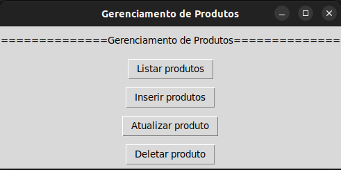

# Building CRUD Applications Using Different Databases

This repository contains the application developed as part of the course [Bancos de Dados SQL e NoSQL: Do Básico ao Avançado](https://www.udemy.com/course/curso-de-banco-de-dados-do-basico-ao-avancado/).

This application emulates a simple product manager, as shown by the main menu bellow.

